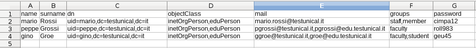
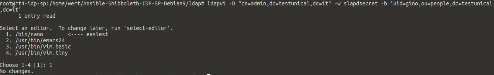
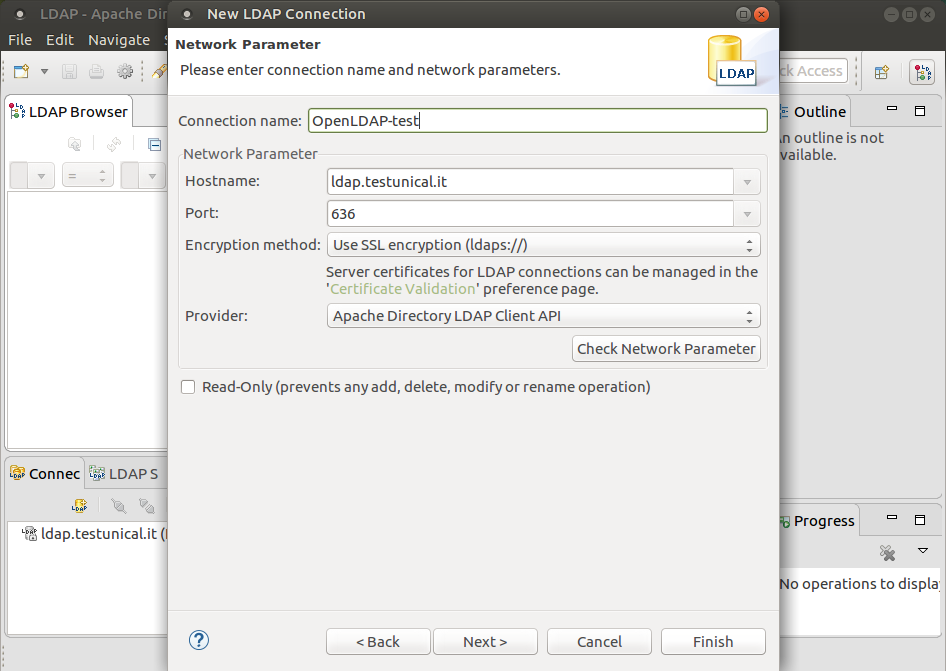
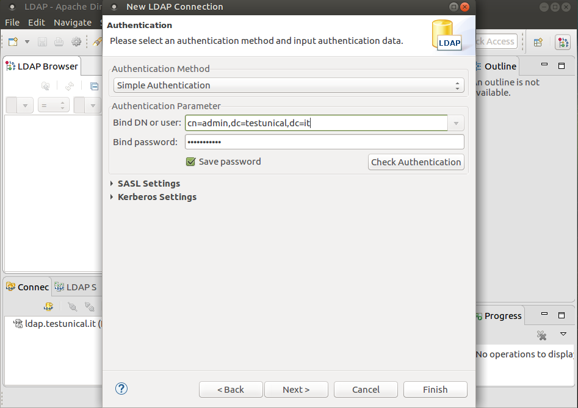
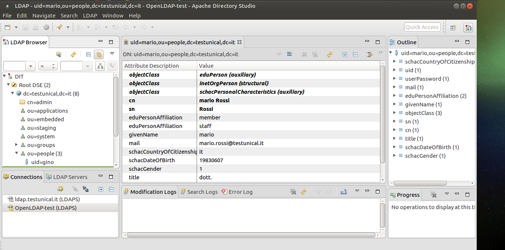
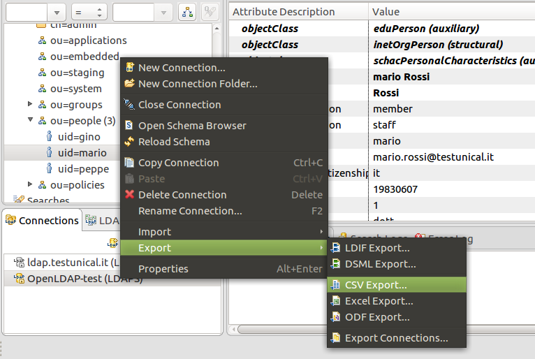

Ansible slapd
-------------
This playbook will install a slapd server with:

 - MDB backend
 - eduperson2016 schema
 - schac-2015 schema
 - memberOf overlay
 - ppolicy overlay
 - pw-sha2 module for SSHA-512, SSHA-384, SSHA-256, SHA-512, SHA-384 and SHA-256 passwords
 - Monitor backend
 - Unique overlay (default field: mail)
 - smbk5pwd overlay
 - accesslog module (for delta replications)
 - syncprov (synrepl) with or without delta replication (delta can be enabled together with accesslog)
 - Unit test for ACL and Password Policy overlay

You can also import users from a CSV file, globals parameters can be edited in playbook.yml.
This behaviour can be suppressed changing this in the playbook:
````
import_example_users: true
````

All about overlays configuration can be found in:
````
roles/slapd_configuration/templates/*
roles/slapd_configuration/files/*
````

For a consumer slapd server please read [_README.delta-syncrepl.md_](README.delta-syncrepl.md).

Tested on
---------
- Debian 9
- Debian 10


Table of contents
-----------------

<!--ts-->
   * #### Installation
       * [Requirements](#requirements)
       * [Setup Certificates](#setup-certificates)
       * [Play this book](#play-this-book)
   * #### LDAP admin tasks
      * [Play with LDAP admin tasks](#play-with-ldap-admin-tasks)
      * [Access Control lists debug](#access-control-lists-debug)
      * [Play with content data](#play-with-content-data)
      * [Remote connections](#remote-connections)
      * [Backup and restore](#backup-and-restore)
   * #### Overlays
      * [MemberOf overlay](#memberof-overlay)
      * [smbk5pwd](#smbk5pwd)
      * [PPolicy management](#ppolicy-management)
      * [Accesslog](#accesslog-overlay)
   * #### Integrations
      * [Samba integration](#samba-integration)
      * [Radius integration](#radius-integration)
      * [Shibboleth IDP integration](#shibboleth-idp-integration)
   * #### Additional resources
      * [Hints](#hints)
      * [Create fake users using CSV file](#create-fake-users-using-csv-file)
      * [Awesome utilities](#awesome-utilities)
      * [Knows bugs](#knows-bugs)
   * [License](#license)
   * [Author information](#author-information)
<!--te-->

Requirements
------------
````
apt install python3-dev python3-setuptools python3-pip easy-rsa expect-dev
pip3 install ansible
````

Setup Certificates
------------------

In order to use SASL/TLS  you must have certificates, for testing purposes
a self-signed certificate will suffice. To learn more about certificates see OpenSSL.

First of all create your certificates and put them in roles/files/certs/ then
configure the FQDN associated to it in playbook variables. A script named make_CA.sh can do this automatically,
it will create your own self signed keys with easy-rsa.

_Remember_ that every client must have `slapd-cacert.pem` path configured in /etc/ldap.conf (pem file could be copied with scp or via web repository) or appending this information as environment variable:

`LDAPTLS_CACERT=/path/cacert.pem ldapsearch -x -H ldaps://thathost.com -b dc=testunical,dc=com 'uid=peppe' -d1`. 

If you don't want to validate the certificates in a ldaps:// connection just put `TLS_REQCERT never` in `/etc/ldap/ldap.conf`...;

Check certificate validity with:

`sudo openssl s_client -host idm.unical.it -port 636 -CAfile /etc/ssl/certs/unical.it/slapd-cacert.pem`

If you need to upgrade your certificates you can do as follow, without restart slapd (olc behaviour):

````
ldapmodify -Y EXTERNAL -H ldapi:/// <<EOF
dn: cn=config
changetype:modify
replace: olcTLSCACertificateFile
olcTLSCACertificateFile: /path/slapd-cacert.pem
-
replace: olcTLSCertificateFile
olcTLSCertificateFile: /path/slapd-cert.pem
-
replace: olcTLSCertificateKeyFile
olcTLSCertificateKeyFile: /path/slapd-key.pem
EOF
````

Play this book
--------------
Running it locally
````
ansible-playbook -i "localhost," -c local playbook.yml [-vvv]

# trick for a pretty print using expect's unbuffer, good for a good unit-test stdout
unbuffer ansible-playbook -i "localhost," -c local playbook.yml | sed 's/\\n/\n/g'
````

Play with LDAP admin tasks
--------------------------
Commands related to OpenLDAP that begin with ldap (like ldapsearch) are
client-side utilities, while commands that begin with slap (like slapcat) are server-side.
Also remeber that ldapi:/// works only locally if executed by root user.

````
# root DSE
ldapsearch -H ldapi:// -x -s base -b "" -LLL "+"

# DITs
ldapsearch -H ldapi:// -x -s base -b "" -LLL "namingContexts"

# config DIT
ldapsearch -H ldapi:// -x -s base -b "" -LLL "configContext"

# read config
ldapsearch -H ldapi:// -Y EXTERNAL -b "cn=config" -LLL

# small config output
ldapsearch -H ldapi:// -Y EXTERNAL -b "cn=config" -LLL -Q dn

# read top level entries
ldapsearch -H ldapi:// -Y EXTERNAL -b "cn=config" -LLL -Q -s base

# find admin entry
ldapsearch -H ldapi:// -Y EXTERNAL -b "cn=config" "(olcRootDN=*)" olcSuffix olcRootDN olcRootPW -LLL -Q

# read builtin schemas
ldapsearch -H ldapi:// -Y EXTERNAL -b "cn=schema,cn=config" -s base -LLL -Q | less

# read additional schemas
# ldapsearch -H ldapi:// -Y EXTERNAL -b "cn=schema,cn=config" -LLL -Q
ldapsearch -H ldapi:// -Y EXTERNAL -b "cn=schema,cn=config" -LLL -Q dn

# get the content of an entry
ldapsearch -H ldapi:// -Y EXTERNAL -b "cn={3}inetorgperson,cn=schema,cn=config" -s base -LLL -Q

# loaded modules
ldapsearch -H ldapi:// -Y EXTERNAL -b "cn=config" -LLL -Q "objectClass=olcModuleList"

# Check Password Policy schema on openLDAP
ldapsearch -QLLLY EXTERNAL -H ldapi:/// -b cn=schema,cn=config cn=*ppolicy dn

# available backends
ldapsearch -H ldapi:// -Y EXTERNAL -b "cn=config" -LLL -Q "objectClass=olcBackendConfig"

# databases configured in
ldapsearch -H ldapi:// -Y EXTERNAL -b "cn=config" -LLL -Q "olcDatabase=*" dn

# view configuration of a database, {number} may vary
ldapsearch -H ldapi:// -Y EXTERNAL -b "olcDatabase={1}mdb,cn=config" -LLL -Q -s base

# view SASL supporthem mechanisms
ldapsearch -x -H ldapi:/// -b "" -LLL -s base supportedSASLMechanisms

# view monitor statistics
LDAPTLS_CACERT=/etc/ssl/certs/unical.it/ca.crt  ldapsearch -LLL -H ldaps://ldap.testunical.it  -D 'cn=monitor,ou=monitor,dc=unical,dc=it' -w monitosecret -b 'cn=Monitor' -s base '(objectClass=*)' '*' '+'

LDAPTLS_CACERT=/etc/ssl/certs/unical.it/ca.crt  ldapsearch -LLL -H ldaps://ldap.testunical.it  -D "cn=monitor,ou=monitor,dc=unical,dc=it"   -w monitorsecret -b "cn=monitor"

````

Access Control lists debug
--------------------------
````
# view running ACL
# ldapsearch -H ldapi:// -Y EXTERNAL -b "cn=config" -LLL olcDatabase={1}mdb olcAccess
ldapsearch -H ldapi:// -Y EXTERNAL -b "cn=config" -LLL olcDatabase=mdb olcAccess

# test ACL
slapacl -F /etc/ldap/slapd.d/  -b "dc=testunical,dc=it" -D "cn=admin,dc=testunical,dc=it"

# test if a normal user could read data of other users
slapacl -F /etc/ldap/slapd.d/  -b "uid=gino,ou=people,dc=testunical,dc=it" -D "uid=mario,ou=people,dc=testunical,dc=it" -d acl 'cn/read'

# test special idp-user in ou=applications with more advanced query
slapacl -F /etc/ldap/slapd.d/ -b "uid=gino,ou=people,dc=testunical,dc=it" -D "uid=idp,ou=applications,dc=testunical,dc=it" -d acl 'cn/read'

# test single field read/write
slapacl -F /etc/ldap/slapd.d/  -b "uid=gino,ou=people,dc=testunical,dc=it" -D "uid=gino,ou=people,dc=testunical,dc=it" -d acl 'cn/write'
slapacl -F /etc/ldap/slapd.d/  -b "uid=gino,ou=people,dc=testunical,dc=it" -D "uid=gino,ou=people,dc=testunical,dc=it" -d acl 'userPassord/write'
slapacl -F /etc/ldap/slapd.d/  -b "uid=gino,ou=people,dc=testunical,dc=it" -D "uid=gino,ou=people,dc=testunical,dc=it" -d acl 'mail/write'

````

Play with content data
----------------------
````
# query entry set
ldapsearch -H ldapi:// -Y EXTERNAL -b "dc=testunical,dc=it" -LLL

# query entry set with operational metadata
ldapsearch -H ldapi:// -Y EXTERNAL -b "dc=testunical,dc=it" -LLL "+"

# the same as previous but with both informations
ldapsearch -H ldapi:// -Y EXTERNAL -b "ou=people,dc=testunical,dc=it" -LLL "*" +

# complex query with filters
ldapsearch -H ldapi:// -D "uid=peppe,ou=people,dc=testunical,dc=it" -w pass  -b 'uid=peppe,ou=people,dc=testunical,dc=it' '(&(objectClass=inetOrgPerson)(objectClass=organizationalPerson)(objectClass=person)(objectClass=userSecurityInformation)(objectClass=eduPerson)(objectClass=radiusprofile)(objectClass=sambaSamAccount)(objectClass=schacContactLocation)(objectClass=schacEmployeeInfo)(objectClass=schacEntryConfidentiality)(objectClass=schacEntryMetadata)(objectClass=schacExperimentalOC)(objectClass=schacGroupMembership)(objectClass=schacLinkageIdentifiers)(objectClass=schacPersonalCharacteristics)(objectClass=schacUserEntitlements)(&(pwdChangedTime>=20180701000000Z)(pwdChangedTime<=20180709000000Z)))'

# mixing two AND in one OR
"(|(&(sn=aiello)(givenName=isabella))(&(sn=de marco)(givenName=giuseppe)))"

# the same as the previous but with wildcard
"(|(&(sn=aiello)(givenName=isabella))(&(sn=de marco)(schacPersonalUniqueCode=*DMRGPP*)))"

# The subschema is a representation of the available classes and attributes.
ldapsearch -H ldapi:// -Y EXTERNAL -b "dc=testunical,dc=it" -LLL subschemaSubentry

# change a normal ldap user password with admin privileges
ldappasswd -H ldaps://ldap.testunical.it -D 'cn=admin,dc=testunical,dc=it' -w slapdsecret  -S -x "uid=gino,ou=people,dc=testunical,dc=it"

# change entries in a interactive way (using a console text editor as vi or nano)
ldapvi -D "cn=admin,dc=testunical,dc=it" -w slapdsecret -b 'uid=gino,ou=people,dc=testunical,dc=it'

````

Remote connections
------------------
````
# bind to ldaps:// on local
ldapsearch -H ldaps:/// -b "dc=testunical,dc=it" -LLL -D "cn=admin,dc=testunical,dc=it" -w slapdsecret

# remote client authentication test (ldap_ca_cert must be copied to clients, hostname must be resolvend at least in /etc/hosts by them)
ldapsearch -H ldaps://ldap.testunical.it:636 -b "dc=testunical,dc=it" -LLL -D "cn=admin,dc=testunical,dc=it" -w slapdsecret -d 1

# test remote client connection
ldapwhoami -x -H ldaps://ldap.testunical.it -D "uid=gino,ou=people,dc=testunical,dc=it" -w geu45 -d 1

# ldap user change his password by himself
ldappasswd -H ldaps://ldap.testunical.it -D 'uid=gino,ou=people,dc=testunical,dc=it' -w ginopassword  -S -x "uid=gino,ou=people,dc=testunical,dc=it"

# better way, using also the old password to be prompted
ldappasswd -H ldaps://ldap.testunical.it -D 'uid=peppelinux,ou=people,dc=testunical,dc=it' -W -A  -S -x "uid=peppelinux,ou=people,dc=testunical,dc=it"
````

Backup and restore
------------------
This playbook, before its execution, will produce a total backup of existing slapd installation, into two separated files.
One for configuration and another one for data entries. The last role, called slapd_test, is used to backup the latter
configuration, destroing all and then restore everything to its original state before running all the other unit tests.
In other words it rebuild all the things done in the tasks, doing a full backup/restore unit test.

The following instruction shows us how to backup and restore slapd by hands.
Remeber that Databases are numbered, with 0 being cn=config, 1 the first back-end you configure, 2 the next etc.

#### Configuration
````
# backup config (you should have to destroy /etc/ldap/slapd.d first if you experience DIT collisions)
slapcat -F /etc/ldap/slapd.d -n 0 -l "$(hostname)-ldap-mdb-config-$(date '+%F').ldif"

# restore configuration
service slapd stop
rm -R /etc/ldap/slapd.d/*
slapadd -n0 -F /etc/ldap/slapd.d -l slapd_config_backup.ldif
chmod -R 0700 openldap /etc/ldap/slapd.d
service slapd start
````

#### Data entries
````
# data backup
slapcat -vl slapd_entries_backup.ldif
# or
# slapcat -b "{{ ldap_basedc }}" -vl slapd_entries_backup.ldif

# restore (you should have to destroy /var/lib/ldap first if you experience DIT collisions)
service slapd stop
rm -R /var/lib/ldap/*
slapadd -n1 -F /etc/ldap/slapd.d -l slapd_entries_backup.ldif
chmod -R 0600 /var/lib/ldap
service slapd start
````
PPolicy management
------------------
If pwdAccountLockedTime is set to 000001010000Z, the user's account has been permanently locked and may only be unlocked by an administrator.

````
# lock out an user
ldapmodify -Y EXTERNAL -H ldapi:/// <<EOF
dn: uid=gino,ou=people,dc=testunical,dc=it
add: pwdAccountLockedTime
pwdAccountLockedTime: 20081021135537Z
EOF

# get all locket out accounts
ldapsearch -LLL -H ldapi:// -D "cn=admin,dc=testunical,dc=it" -b "ou=people,dc=testunical,dc=it" "pwdAccountLockedTime=*" pwdAccountLockedTime

# unlock ldif
ldapmodify -Y EXTERNAL -H ldapi:/// <<EOF
dn: uid=gino,ou=people,dc=testunical,dc=it
changetype: modify
delete: pwdAccountLockedTime
EOF

# unlock with ldapvi
ldapvi -D 'cn=admin,dc=testunical,dc=it' -w slapdsecret -b 'uid=mario,ou=people,dc=testunical,dc=it' "pwdAccountLockedTime=*" pwdAccountLockedTime

# or pwdReset. It must be then resetted using ldappasswd
dn: cn=gino,ou=people,dc=testunical,dc=it
changetype: modify
add: pwdReset
pwdReset: TRUE

# force a pwdReset with ldapvi
# WARNING: if admin will change a userpassword this way smbk5pwd overlay will not trigger sambaNTpassword update!
ldapvi -D 'cn=admin,dc=testunical,dc=it' -w slapdsecret -b 'uid=mario,ou=people,dc=testunical,dc=it' "pwdReset=*" pwdReset

# a user that resets a password by his own
# smbk5pwd will trigger sambaNTpassword update
ldappasswd -D 'uid=mario,ou=people,dc=testunical,dc=it' -a cimpa12 -w cimpa12 -s newpassword

````

Accesslog overlay
--------------------------
The  Access  Logging  overlay  can  be used to record all accesses to a
given backend database on another database.  This  allows  all  of  the
activity  on  a  given  database  to  be  reviewed using arbitrary LDAP
queries,  instead  of  just  logging  to   local   flat   text   files.
Configuration options are available for selecting a subset of operation
types to log, and to automatically prune older  log  records  from  the
logging database.  Log records are stored with audit schema (see below)
to assure their readability whether viewed as LDIF or in raw form.

Customize its attributes in the playbook.yml file:

````
    # Access log overlay, it keep track of all or selected operations on a particular DIT (the target DIT)
    # read, write, all. See: https://linux.die.net/man/5/slapo-accesslog
    accesslog_ops: writes bind
    # 186days+0hours check every day
    accesslog_logpurge: "186+00:00 1+00:00"
````


MemberOf overlay
--------------------------
MemberOf overlay made a client to be able to determine which groups an entry
is a member of, without performing an additional search. Examples of this
are applications using the DIT for access control based on group authorization.

The memberof overlay updates an attribute (by default memberOf) whenever
changes occur to the membership attribute (by default member) of entries of
the objectclass (by default groupOfNames) configured to trigger updates.

Thus, it provides maintenance of the list of groups an entry is a
member of, when usual maintenance of groups is done by modifying the
members on the group entry.

Important consideration for SQL addicted:

Because of its hierchical approach, the times when memberOf reference integrity will be funcional are when:

- you add or remove a member in a ou=group: the membership would appear or disappear in ou=people objects;
- you modify a cn, a name, of a ou=group: the membership's cn would change also in peoples objects;

This intelligibly demostrates the top-down approach of the hierchical database.
An also popular "trick" could be to remove all users from their groups and re-add them to force the syncronization.
If you change or add a memberOf attribute in a member ldif, example: in uid=mario,ou=people,dc=testunical,dc=it:

- if the corresponding group does not exists the value will be added in a silly multi-valued way, even if it doesn't exists in ou=group (no way to raise exception here!);
- if the cn exists in ou=groups it will be linked to memberOf top-down reference integrity.

Reference Integrity in LDAP is know to be very weak compared to SQL, no more to say.

smbk5pwd
--------

smbk5pwd extends the PasswordModify Extended Operation to update Kerberos keys and Samba
password hashes for an LDAP user.

It will only works if the password is changed using ldappasswd!

Shibboleth IDP integration
--------------------------
A special OU called "idp" makes every entry in it to read all attributes of ou=people entries.
````
olcAccess: to dn.subtree="ou=people,{{ ldap_basedc }}"
 by dn.children="ou=ipd,{{ ldap_basedc }}" read
 by self read
 by * none
````

Samba integration
---------------
This playbook does not do this but comes with samba3.ldif schema already loaded in, if you need it.
This openldap configuration only needs of sambaNTpassword for freeRadius integration and it implements
a light samba3 schema that permits us to create accounts with the need of sambaSID attribute.

This option could be reverted to original samba3 schema changing in playbook:

````
# for example people entries
    import_example_users_ldif: entries-people-extended-nosambaSID.ldif
    # to
    import_example_users_ldif: entries-people-extended.ldif

# and
    samba_schema: samba3-lightAccount.ldif
    # to
    samba_schema: samba3.ldif

````

A more comprehensive reference here:
- http://pig.made-it.com/samba-accounts.html
- https://wiki.samba.org/index.php/3.0:_Initialization_LDAP_Database

````
# silly hints for samba Domain configuration
apt install samba-common-bin

net getlocalsid
# SID for domain SLAPD-D9 is: S-1-5-21-373095595-3990083659-665560725

# if you need to change it, example:
net setlocalsid S-1-5-21-33300351-1172445578-3061011111
````

Radius integration
------------------
This playbook came with freeradius schema for radius authentication over LDAP.
If you need the sambaNTPassword field in your accounts entries, with a real sambaSAMaccount you should include a
sambaSID univoque value for every user (read previous paragraph Samba integration), otherwise you'll get this exception:

````
ldap_add: Object class violation (65)
    additional info: object class 'sambaSamAccount' requires attribute 'sambaSID'

````

Get some random SID you can use samba_sid.sh script as follows:
````
#bash samba_sid.sh
S-1-5-21-3029086335-4292621882-1389276266
````

To get a workin NT-hash you can use smbpassword or the included nt_passwd.py script
as follows:
````
pip3 install passlib
python3 nt_passwd.py yourpassword
# 5dfb7533508b0ea192ccf7f6b64427fc
````

Default options of this playbook does not implement a full sambaSamAccount but you can change default options as well.

Hints
-----
- Be aware that ldapmodify is sensitive to (trailing) spaces, if your editor removes trailing space on save...;
- https://www.openldap.org/doc/admin24/appendix-common-errors.html
- Error 80 (implementation specific error) raises when tls certs doesn't have read permissions or if the ldif used with ldapadd/ldapmodify have some trailing spaces or too many blank lines or some syntax error. In other words for everything not well undestood, found in a ldif file, by slapd interpreter;
- Passwords in the CSV example file will be stored by LDAP in cleartex format, don't do this in production environment, {SSHA} is a good choice. You can find a good SSHA generator here: https://github.com/peppelinux/pySSHA-slapd
- SCHACH objectClasses are well listed here: https://wiki.refeds.org/display/STAN/SCHAC+OID+Registry
- https://confluence.atlassian.com/kb/how-to-write-ldap-search-filters-792496933.html
- PPolicy: https://tools.ietf.org/id/draft-behera-ldap-password-policy-10.html
- The best examples comes from slapd [unit test suite](https://github.com/benegon/openldap/tree/master/tests/scripts)

Create fake users using CSV file
--------------------------------
It would be also possible to create your own custom fake users using a CSV file


You can create and Map oid to one or more csv columns in the csv2ldif.py file.
Csv2ldif.py works this way: if a value contains ('name', 'surname') in ATTRIBUTES_MAP the corrisponding csv columns
will be merged into one oid value, named with the relative ATTRIBUTES_MAP key.
If csv column value is composed by many values separated by commas instead,
it will create many ldif rows how the splitted csv values are.
````
# csv2ldif.py
ATTRIBUTES_MAP=OrderedDict([('dn', 'dn'),
                            ('objectClass', 'objectClass'),
                            ('uid','dn'),
                            ('sn', 'surname'),
                            ('givenName', 'name'),
                            ('cn', ('name', 'surname')),
                            ('mail', 'mail'),
                            ('userPassword', 'password'),
                            ('edupersonAffiliation', 'groups')])
````

Edit the users in the csv file and then export them in ldif format using csv2ldif:
````
cd roles/slapd/templates/entries/
# edit csv file
nano entries-people.csv
python csv2ldif.py entries-people.csv > entries-people.ldif
python csv2ldif.py entries-people.csv
````

It simply print the exported ldif format in stdout:
````
dn: uid=mario,dc=testunical,dc=it
objectClass: inetOrgPerson
objectClass: eduPerson
uid: mario
sn: Rossi
givenName: mario
cn: mario Rossi
mail: mario.rossi@testunical.it
userPassword: cimpa12
edupersonAffiliation: staff
edupersonAffiliation: member

dn: uid=peppe,dc=testunical,dc=it
objectClass: inetOrgPerson
objectClass: eduPerson
uid: peppe
sn: Grossi
givenName: peppe
cn: peppe Grossi
mail: pgrossi@testunical.it
mail: pgrossi@edu.testunical.it
userPassword: roll983
edupersonAffiliation: faculty

[...]
````
This is not mandatory, probably you'll prefer to use a standard ldif format!

Awesome utilities
-----------------
Tools to test and use before you die.

- ldapvi makes a query and let us modify its content, and save this in LDAP, using our favorite system text editor (as vi or nano!) :
  - http://www.lichteblau.com/ldapvi/manual/



- ldapsh let us navigate the LDAP tree like a filesystem tree, awesome!
  - http://ldapsh.sourceforge.net/

- ApacheDirectoryStudio is a very good LDAP general purpose navigator. You can download it from its official site: http://directory.apache.org/studio/downloads.html






Knows bugs
----------

It could be possible to experience this kind of exception at the end of the playbook execution:
````
Exception ignored in: <function WeakValueDictionary.__init__.<locals>.remove at 0x7f7c3915dd08>
Traceback (most recent call last):
  File "/usr/lib/python3.5/weakref.py", line 117, in remove
````
This is a well know bug of Ansible in Python3, nothing important for our needs.

License
-------
ansible-slapd-eduperson2016 is made by Giuseppe De Marco and it's released under the GPL 3 license.

Author Information
------------------
Giuseppe De Marco <giuseppe.demarco@unical.it>
